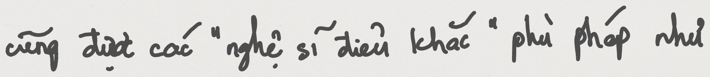

# VNSynHWS - Vietnamese Synthetic Handwriting dataset

## Statistic of the dataset

| Dataset | Total |
|:---|:---|
| VNSynHWS-word | 407,464 |
| VNSynHWS-line | 43,527 |
| VNSynHWS-paragraph | 11,440 |

* Our dataset has 3 parts in total:

    * VNSynHWS-word: [VNSynHWS-word-real](https://drive.google.com/file/d/13o_QH20nGNnJ3hO3v_6TOcgg_pOWzJx4/view?usp=sharing) and [VNSynHWS-word-syn](https://drive.google.com/file/d/19UXY1vTnb4gg59cPvAvUtWQ35lxFTHAl/view?usp=sharing)

    * VNSynHWS-line: [VNSynHWS-line-real](https://drive.google.com/file/d/1B7HaS5muctgqD__pypuAe4LB8M5J8lYG/view?usp=sharing) and [VNSynHWS-line-syn](https://drive.google.com/file/d/1YT1GlWH_hhwMEDlrr2aPCUSfE0Jx5KDb/view?usp=sharing)

    * VNSynHWS-paragraph: [VNSynHWS-paragraph](https://drive.google.com/file/d/1mM8Ec3gcpOO0CiuMw4nzua63Z-cYMEqA/view?usp=sharing)

## Example images

* Some examples from the training set of the VNSynHWS dataset:

    * VNSynHWS-word:

         

         

    * VNSynHWS-line:

         

         

    * VNSynHWS-paragraph:

        